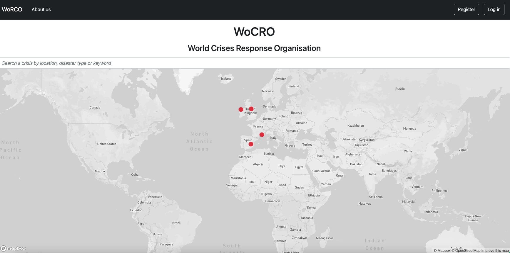
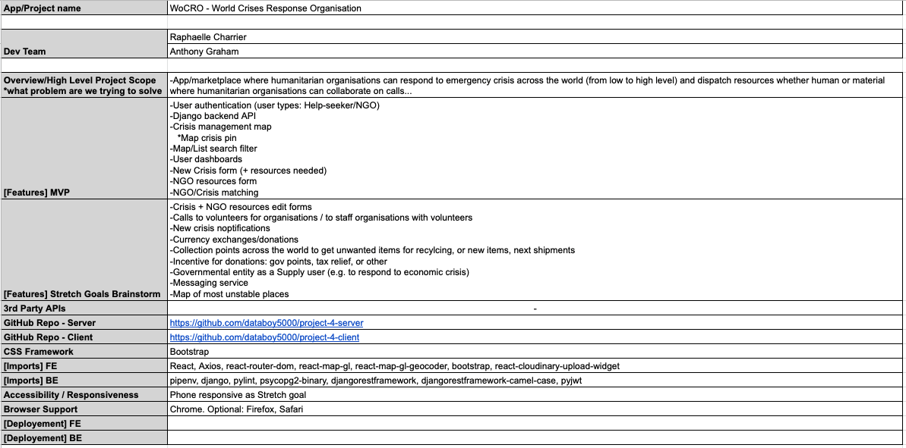
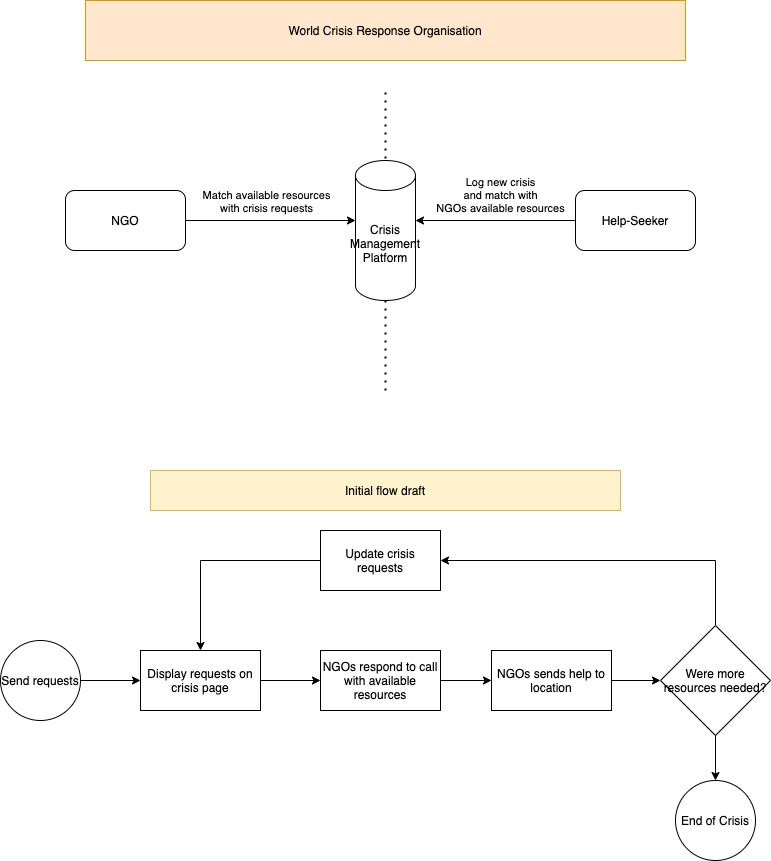
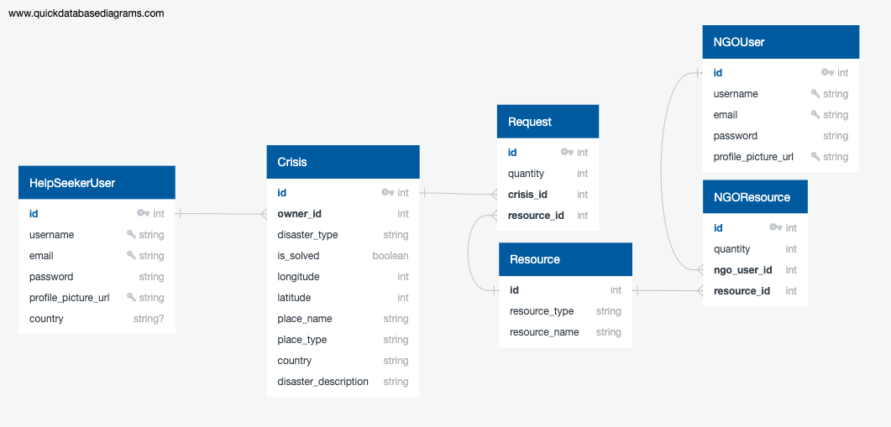
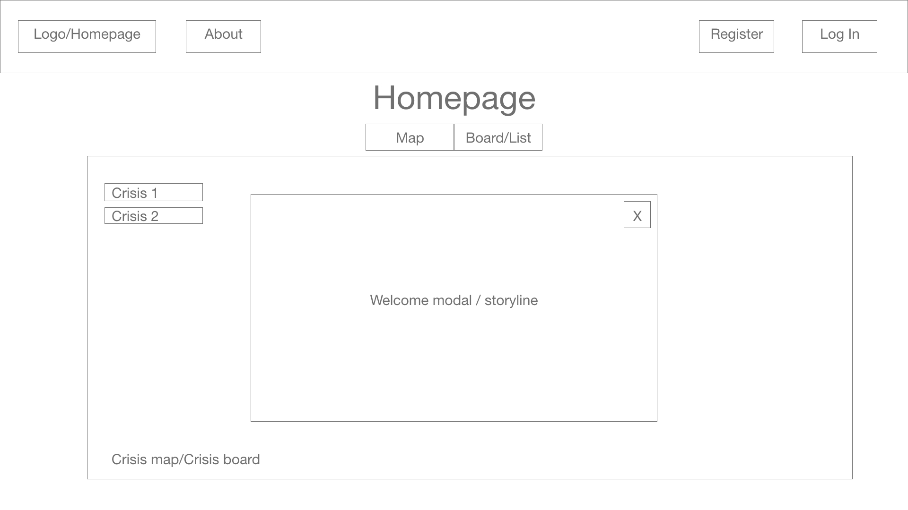
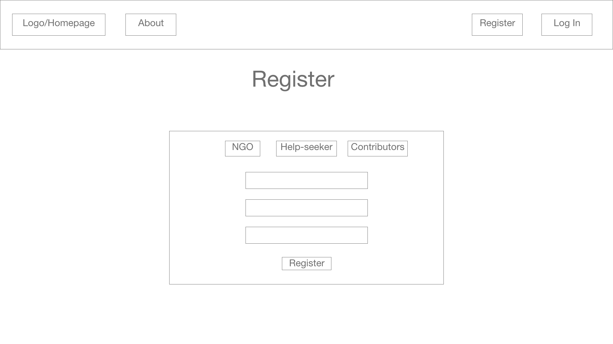
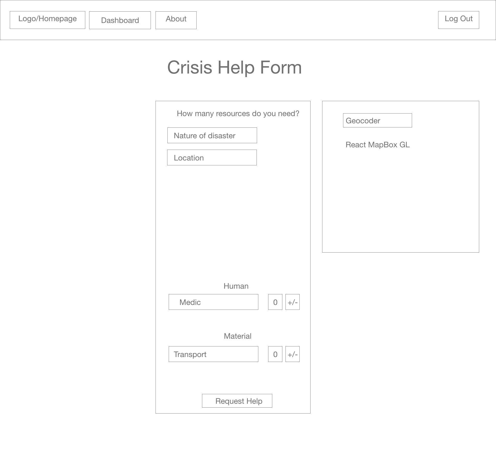
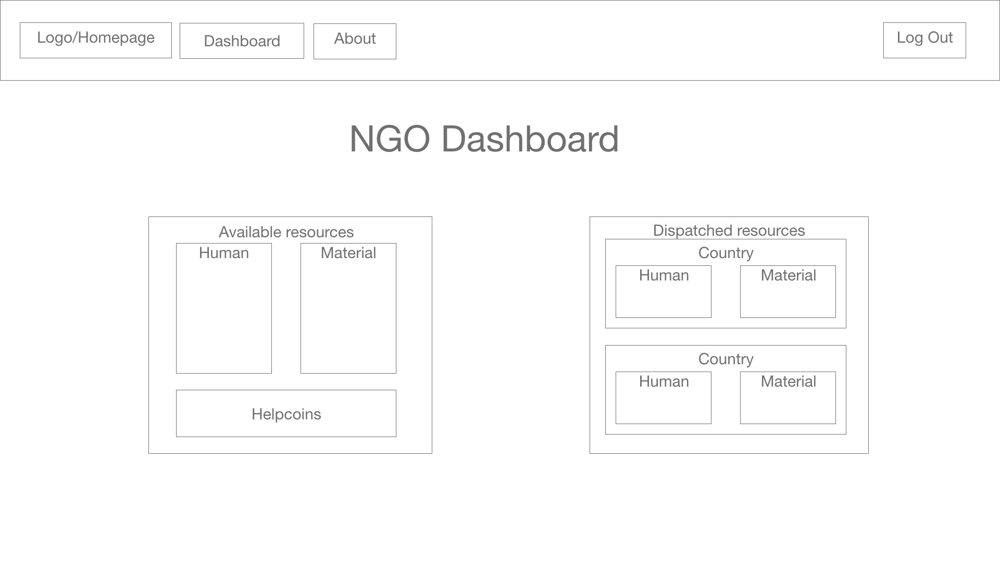
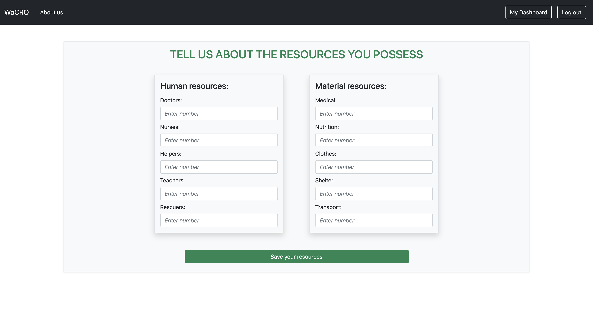

#  Project 4: WoCRO
## World Crisis Response Organisation

by [Raphaëlle Charrier](https://github.com/RaphaelleC) and [Anthony Graham](https://github.com/databoy5000/).

[Link to the client repository.](https://github.com/RaphaelleC/project-4-client)

WoCRO is an app for Help-seekers and NGOs to log major world crises into one place and to collaborate efficently on solving them.



## Contents

- [Project Brief](#project-brief)
- [Approach](#approach)
- [Technologies](#technologies-used)
- [Project Planning Diagrams](#project-planning-diagrams)
- [Responsibilities](#responsibilities)
- [Key Learnings](#key-learnings)
- [Achievements](#achievements)
- [Challenges](#challenges)
- [Conclusions](#conclusions)

## Project Brief

* **Build a full-stack application** by making your own backend and your own front-end
* **Use a Python Django API** using Django REST Framework to serve your data from a Postgres database
* **Consume your API with a separate front-end** built with React
* **Be a complete product** which most likely means multiple relationships and CRUD functionality for at least a couple of models
* **Implement thoughtful user stories/wireframes** that are significant enough to help you know which features are core MVP and which you can cut
* **Have a visually impressive design** to kick your portfolio up a notch and have something to wow future clients & employers. **ALLOW** time for this
* **Be deployed online** so it's publicly accessible

## Approach

To guarantee continuity during the project build, we established the following elements:
* To assure communications on a messaging app where we could write, talk, exchange resources and share screens.
* [Project Management Sheet](https://docs.google.com/spreadsheets/d/1g-ZKAiVj09dBAaLHXUu5pl-V6kxmzfIp10CzKzqRgqc/view): to document the project scope and all specifications to the app into a single shared space.

(Sample of the main specifications tab)
<center>
  
</center><br>

Then, we defined the following milestones:
1. Establish database collections, their relationships and validated diagram.
2. Define API endpoints.
3. Construct wireframes.
4. Build cycle :
    - Task planning/coordinating.
    - Code.
    - Test.
    - Fix errors.
    - Push working feature to GitHub.
5. Style completed components/pages.
6. Final tests to validate app flow and design finishing.
7. Backend & Frontend deployment.

During the <ins>build cycle</ins>, we worked our way linearly from the back-end to the front-end, clearly defining tasks (one or multiple complete features per task) between us to work through them separately in order to have minimum overlap, avoiding merge conflicts and/or work being done twice.

For the back end, I was in charge of implementing the authorization part, which is everything user related (user model, register and login views, user serializer).

For the front end, I also developped the user features (register and login forms), as well as the create NGO resources form, and the implementation of Mapbox and Cloudinary.

## Technologies Used

### <ins>Back-end</ins>

<br>
<br>


#### Additional technologies:

* TablePlus
* pyjwt
* pipenv
* pylint
* DjangoREST camel case

### <ins>Front-end</ins>

<br>
<br>
<br>


#### Additional technologies:

* SASS
* Axios
* Cloudinary
* React MapGL
* React MapGL Geocoder

## Project Planning Diagrams

### <ins>Flow Chart</ins>

Setting the flow chart allowed us to brainstorm our way from a few different ideas to a sustainable one, and allowing us to manage expectations during the build across the team.

<center>
  
</center>

### <ins>Entity Relationship Diagram</ins>

<center>
  
</center>

### <ins>Wireframes</ins>

The wireframes include features which we thought could be part of our MVP. We quickly realised whilst working our way through the back end that we had to make things simpler to complete our MVP within the given deadline.

#### <center><ins>Homepage</ins></center>

<center>
  
</center>

#### <center><ins>Register Form</ins></center>

<center>
  
</center>

#### <center><ins>New Crisis Form</ins></center>

<center>
  
</center>

#### <center><ins>NGO Dashboard</ins></center>

<center>
  
</center>

## Responsibilities

### Back-end

We started by building the back end first, following our ERD. My part was to build the user authentication app.<br>

The main difficulty I encountered was about the 2 different types of user we wanted to have. I've had a look on the internet, found a pretty easy to follow guide, but couldn't make it work as I wanted. After asking advice to one of our teaching assistants, he told me that creating 2 different types of user via the back end would be too complicated for me, given the time we had to work on this project. I then decided to tweak the serializer and the views on the back end, as well as the registration form on the front end, to make it work.<br>

Here is the serializer :
```python
class UserSerializer(serializers.ModelSerializer):
    password = serializers.CharField(write_only=True)
    password_confirmation = serializers.CharField(write_only=True)

    def validate(self, data):
        password = data.pop('password')
        password_confirmation = data.pop('password_confirmation')

        if password != password_confirmation:
            raise ValidationError({'password_confirmation': 'Passwords do not match'})

        if (data['user_type'] == 'Help-seeker') and (not data['country'] or data['country'] == ''):
            raise ValidationError({'country': ['This field may not be blank.']})

        try:
            validations.validate_password(password=password)
        except ValidationError as err:
            raise ValidationError({'password': err.messages})

        data['password'] = make_password(password)

        return data

    class Meta:
        model = User
        fields = '__all__'
```
Our 2 user types are 'Help-seeker' and 'NGO'. We want the Help-seeker to have a country registered, which must be unique for each Help-seeker, while we don't want the NGO users to have a country associated.

Here is the registeration view :
```python
class RegisterView(APIView):
    def post(self, request):
        user_to_create = UserSerializer(data=request.data)
        if user_to_create.is_valid():
            if request.data['user_type'] == 'Help-seeker':
                try:
                    User.objects.get(country=request.data['country'])
                except User.DoesNotExist:
                    user_to_create.save()
                    return Response(
                        {'message': 'Registration successful'},
                        status=status.HTTP_201_CREATED
                    )
                return Response({'country': ['Help seeker already exists for this country.']}, status=status.HTTP_409_CONFLICT)
            else:
                user_to_create.save()
                return Response(
                    {'message': 'Registration successful'},
                    status=status.HTTP_201_CREATED
                )
                
        return Response(user_to_create.errors, status=status.HTTP_422_UNPROCESSABLE_ENTITY)
```
It first checks if the user type is 'Help-seeker', and if so, checks if the country registered already exists in our database.<br>

The last tweak comes in the front end, with the registration form, because we don't want the parameter 'country' of the NGO to be blank, but to keep it as an empty string.

### Front-end

### Forms

#### Registration form

The last piece needed for the 2 user types comes with the ```handleSubmit``` part of the form :
```javascript
const handleSubmit = async (e) => {
    e.preventDefault()

    if (formData.userType === 'NGO') {
      formData.country = ''
    }

    if (formData.profilePictureUrl === '') {
      formData.profilePictureUrl = 'https://i.imgur.com/6da62wI.png?1'
    }

    try {

      const res = await registerUser(formData)
      setToken(res.data.token)

      if (isNGO()) {
        history.push('/ngo/dashboard/')
      } else {
        history.push('/hs/dashboard/')
      }
      
    } catch (err) {
      if (formData.userType === 'Help-seeker' && formData.country === '') {
        setFormErrors({ ...formErrors,
          ...err.response.data,
          country: ['This field may not be blank.'],
        })
      } else {
        setFormErrors({ ...formErrors, ...err.response.data })
      }
    }
  }
```
I decided to not show the country label and field when the user signing in is an NGO :

```javascript
{formData.userType === 'Help-seeker' ?
  <div>
    <label className="col-form-label">As a help-seeker, please enter your country:</label>
    <input 
      className={`
      form-control fw-light fst-italic
        ${formErrors.country ? 'is-invalid' : ''}
      `}
      name="country"
      id="country"
      placeholder="Country"
      onChange={handleChange}
      onBlur={handleFormError}
    />
    {formErrors.country && ( 
      <p className="custom-invalid">{formErrors.country}</p>
    )}
  </div>
  :
  ''
}
```
This way, the NGO user doesn't have to worry about it, and the country field is automaticaly filled with an empty string on submit.<br>

With all this, I managed to create 2 user types with only one user model. That way, we can filter which user we want to show/use on our app with the user type property.

#### Create NGO resources form

The difficulty of this form is that it takes and save data of objects in an array. Before this project, we worked with only an object with multiple properties.<br>

```javascript
export const ngoResourcesForm = {
  resources: [
    {
      resource: 1,
      quantity: '',
    },
    {
      resource: 2,
      quantity: '',
    },
    {
      resource: 3,
      quantity: '',
    },
    {
      resource: 4,
      quantity: '',
    },
    {
      resource: 5,
      quantity: '',
    },
    {
      resource: 6,
      quantity: '',
    },
    {
      resource: 7,
      quantity: '',
    },
    {
      resource: 8,
      quantity: '',
    },
    {
      resource: 9,
      quantity: '',
    },
    {
      resource: 10,
      quantity: '',
    }
  ],
}
```
Thus, we used a for loop to go through that and get the data we needed.

```javascript
const handleNestedChange = (e) => {
  for (let i = 0; i < formData.resources.length; i++) {
    if (formData.resources[i].resource === Number(e.target.id)) {
      const availableCopy = [ ...formData.resources ]
      availableCopy[i] = { ...availableCopy[i], quantity: e.target.value }

      setFormData({ ...FormData, resources: availableCopy })
      return
    }
  }
}
```

#### Website layout

We had a bit more than 3 days left when I decided to start working on the layout of our app. We agreed to use Bootstrap for our project, as it's a well documented CSS library that seemed easy to use. I started with the NGO resource form as I just finished it.<br>

The hardest part was to find an idea of how I wanted it to look like. The only criteria I had was that it had to be a sober design as it's a 'serious' app, so not too many colours and a professional looking layout. I tried a few things with the CSS classes Bootstrap has, until I was happy with the result.<br>



I sent a screenshot of this form to Anthony, and as he liked it as well, I continued to style the other pages of our app, with a few changements depending on the data that is shown.

### MapGL

Anthony already used MapGL in his previous project, so he explained to me how it worked and I've been able to implement it in our app.<br>

We've added some functionalities like the pulsating dots to show the locations of the crises, the use of the coordinates in the create crisis form.

### Cloudinary

Although Cloudinary had been used on my previous project, I wasn't the one to implement it. So I decided to do so on this one.<br>

With the help of a guide our teachers made for us, I managed to make it work so that users can add a profile picture when registering:

```javascript
function ImageUpload({ onUpload }) {
  const [image, setImage] = React.useState(null)

  function handleUpload() {
    window.cloudinary
      .createUploadWidget(
        {
          cloudName: uploadUrl,
          uploadPreset,
          sources: ['local'],
          multiple: false,
        },
        (err, result) => {
          if (err) console.log(err)
          if (result.event === 'success') {
            setImage(result.info.url)
            onUpload(result.info.url)
          }
        }
      )
      .open()
  }

  return (
    <>
      {image && }
      {!image && <button onClick={handleUpload} type="button">Upload Image</button>}
    </>
  )
}

export default ImageUpload
```

## Key Learnings

* Better understanding of django restframework and PostgreSQL : to put these technologies into practice in a concrete project helped me understand how they work. It took a bit more time than for Mongo and Express as they use Python. The naming conventions and the logic behind the back end is also different but I managed to understand and differentiate them.
* Basic knowledge of MapGL and Cloudinary : as I implemented these two functionalities, I understand how they work for a simple usage. 
* Consolidation of my React skills : I am more confident with using React and creating a nice front end. This project has been the most complicated I've done so far. It has more pages and links between them, more relationships than the previous project I worked on. 

## Achievements

* Handled a double user app : I think this is one of the tings I am the most proud of in this project. It's the firt time I had to implement two user types in an app, while using Python, Django and PostgreSQL for the first time as well.
* Handle complex relationships between different models : creating an easy-to-read ERD has been trickier than we first expected, but we managed to get a nice one eventually.
* Professional design : I spent a lot of time working on the styling and appearance of our app. I am thankful that we decided to use Bootstrap as it has a very nice library which is easy to follow.

## Challenges

The biggest challenges we've encountered on this project were writing down a clear and simple ERD, as well as implementing it in our back end. All the different relationships were difficult to implement at first.<br> 
Having to deal with 2 different users to put into a single user type took some time to manage and to figure out but I'm really happy with how I handled it.<br>
Coming up with a general idea of our website's layout also took some time to think and test different styles and possibilities, although we knew that we wanted a sober and not extravagant look.

## Conclusions

This project made me realize even more that some things require more time to code correctly than expected, and to lower the difficulty/level of a functionality when we saw that it would take too much effort compared to the payout, to come up with a project that is doable within the given timeframe.<br>

With more time, we would have liked to implement a system where NGOs can send resources to Help-seekers, and not simply compare their stock with what a crisis needs. We would have made it so that when an NGO sends resources, their stock is lowered, as well as the resources a crisis needs. If all the resources are sent, the crisis status would have been changed to 'resolved'.<br> Also, there would have been a timer on the human resources, meaning that they would come back as 'stock' after a given period of time, while the material resources would all be consumed and thus not recovered.